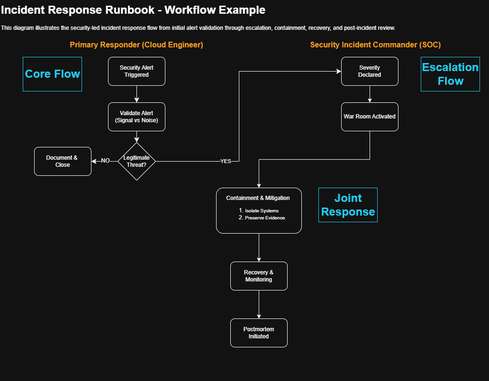

# Security Incident Response Runbook

**Document Type:** Operational Runbook  
**Environment:** Hybrid / Cloud  
**Role:** Cloud Engineer – Primary Responder  
**Incident Model:** Security-Led (Enterprise SOC)  
**Change Model:** Emergency changes allowed with retroactive approval

---
## Workflow Overview

*This diagram illustrates the security-led incident response flow from initial alert validation through escalation, containment, recovery, and post-incident review.*

## 1. Purpose

This runbook defines the standard operating procedure for responding to security alerts affecting production systems in hybrid and cloud environments. It is designed for cloud engineers acting as **primary responders** in coordination with a **security-led incident command** structure.

Primary goals:
- Validate alerts quickly (signal vs noise)
- Contain risk and reduce blast radius
- Preserve evidence for investigation
- Restore service confidence safely
- Document actions for auditability and learning

---

## 2. Roles and Responsibilities

### Primary Responder (Cloud Engineer)
Responsible for:
- Alert validation and initial triage
- Severity recommendation (business + technical)
- Rapid escalation to Security Incident Commander (IC)
- Executing approved containment actions
- Preserving logs/evidence
- Maintaining real-time incident notes and timeline

### Security Incident Commander (Security IC)
Responsible for:
- Declaring incident severity and incident state
- Directing containment and investigative priorities
- Coordinating SOC, legal/compliance, and leadership comms
- Approving destructive/irreversible actions

### Supporting Roles (as needed)
- SOC Analyst / Threat Hunter
- Cloud/Infrastructure Engineer
- Application Owner
- Network Engineer
- Legal/Compliance, Privacy, Communications

---

## 3. Entry Criteria

Trigger this runbook when:
- A security alert indicates potential malicious activity (confirmed or suspected)
- The affected asset is production or production-adjacent
- The alert source is trusted (SIEM, EDR, IDS/IPS, CSP-native tooling)

---

## 4. Initial Data to Capture (Start Immediately)

Record the following in the incident notes:
- Alert source and alert ID
- Timestamp(s) (use UTC if possible)
- Affected asset(s): hostname/instance ID, IP, environment, owner/team
- Reported indicators (IOCs): hashes, domains, IPs, users, processes
- Initial observed impact (customer-facing, internal only, unknown)

---

## 5. Phase 1: Alert Validation (First 5–10 Minutes)

### Objective
Confirm whether the alert is legitimate and actionable.

### Checklist
- Confirm alert source and reliability (tool, rule, detection confidence)
- Validate asset identity (correct host, environment, account/subscription)
- Determine if activity matches known false positives
- Check for corroborating signals:
  - EDR process tree
  - Auth anomalies (impossible travel, MFA bypass, new tokens)
  - Network connections to suspicious endpoints
  - New services, scheduled tasks, persistence indicators
- Identify immediate blast radius risk:
  - Privileged identity involved?
  - Domain admin / root / break-glass access?
  - Shared service host?

### Decision
- **False Positive / Benign:** Document rationale, tune detection if needed, close per SOC workflow.
- **Suspected/Confirmed Threat:** Proceed to escalation.

---

## 6. Phase 2: Severity Recommendation

Severity is based on **business impact + technical impact**. If uncertain, escalate and recommend higher severity.

### Quick Severity Heuristics
Recommend **SEV-1** if any of the following are true:
- Confirmed compromise of production systems
- Privileged access abuse
- Data exfiltration suspected or confirmed
- Lateral movement observed

Recommend **SEV-2** if:
- Malicious activity confirmed but scope appears limited/contained
- Production impact is possible but not fully realized

Recommend **SEV-3** if:
- Isolated event, minimal impact, no privilege escalation, no lateral movement

Recommend **SEV-4** if:
- Informational / benign / false positive

---

## 7. Phase 3: Escalation and War Room Activation

### Escalation Conditions (Immediate)
- Production systems involved
- Privileged account activity suspected
- Multiple hosts/users affected
- Unknown scope (blast radius unclear)

### Actions
- Notify Security IC with a concise summary:
  - What happened
  - What systems/identities are involved
  - Current impact
  - Proposed severity
  - Recommended immediate containment actions
- Activate war room (Teams/Slack) if SEV-1/SEV-2 or scope unclear
- Invite required stakeholders:
  - Security IC, SOC, Cloud/Infra, App owner, Network
  - Add Legal/Compliance if data exposure is suspected

### Communication Rules
- Single channel for official updates
- Avoid side threads that lose decisions
- Assign a note-taker if possible
- Start and maintain the timeline

---

## 8. Phase 4: Containment Support (Primary Responder Actions)

### Guiding Principles
- Contain quickly to reduce blast radius
- Preserve evidence before destructive actions
- Avoid irreversible changes without Security IC approval
- Prefer isolation over termination

### Approved Containment Actions (when authorized by Security IC)
**Access Controls**
- Disable/rotate compromised credentials
- Revoke elevated privileges
- Require MFA / step-up auth for affected identities

**Network Isolation**
- Restrict inbound/outbound traffic for affected workloads
- Isolate suspect systems into a quarantine segment
- Block known bad IPs/domains at appropriate choke points

**Compute Containment**
- Stop or quarantine compromised hosts (avoid destroy)
- Capture snapshots/images before remediation (disk and relevant artifacts)

**Evidence Preservation**
- Preserve relevant logs (auth, network, system, application)
- Ensure retention settings prevent loss during investigation

---

## 9. Prohibited Actions (Without Explicit Security IC Approval)

Do not perform these actions unless explicitly authorized:
- Terminate/destroy compromised systems
- Delete logs, snapshots, or evidence artifacts
- Mass credential resets without validated scope
- Broad network changes that risk unrelated outages

---

## 10. Phase 5: Eradication and Recovery (Support Security-Led Plan)

### Objectives
- Remove threat presence
- Restore system integrity
- Confirm normal operations and monitoring stability

### Actions (Support)
- Apply remediation steps provided by Security IC / SOC
- Validate system baselines and patch levels
- Confirm monitoring and alerting is operational
- Watch for reoccurrence and secondary indicators

### Exit Criteria
- Threat contained and eradicated (per Security IC)
- Affected systems validated clean
- Business operations stable
- Post-incident tasks assigned

---

## 11. Documentation Requirements (Mandatory)

During the incident, document:
- All actions taken (who/what/when/why)
- Decisions made and by whom
- Evidence captured and where stored
- Scope changes (new affected systems/users)

After the incident, ensure:
- Emergency changes are documented for retroactive approval
- Artifacts are linked to the postmortem

---

## 12. Post-Incident: Blameless Postmortem (Trigger Conditions)

Required for:
- SEV-1 and SEV-2 incidents
Recommended for:
- SEV-3 incidents with learning value or control gaps

Postmortem must include:
- Authoritative timeline
- Root cause and contributing factors
- What went well / what didn’t
- Preventative and corrective actions with owners and due dates

---

## 13. AWS Mapping (Reference)

This runbook is platform-agnostic. Common AWS equivalents include:

- **Identity / Access:** IAM users/roles/policies, access keys, session tokens, MFA
- **Detection:** GuardDuty, Security Hub, CloudTrail, CloudWatch
- **Network Isolation:** Security Groups, NACLs, Route Tables, VPC endpoints
- **Evidence Storage:** S3 with versioning/object lock, centralized logging accounts
- **Compute:** EC2 stop/isolate, EBS snapshots, AMI creation

---

## Appendix A: Security IC Notification Template

Copy/paste into war room or paging tool:

**Summary:**  
**Severity Recommendation:** SEV-__  
**Affected Assets:**  
**Indicators:**  
**Observed Impact:**  
**Immediate Risk:**  
**Actions Taken So Far:**  
**Recommended Next Steps:**  
**Evidence Captured:** (logs, snapshots, IDs)

---

## Appendix B: Minimal Timeline Template (UTC)

| Time (UTC) | Event | Owner |
|-----------|-------|-------|
| | Alert detected | |
| | Validation completed | |
| | Security IC notified | |
| | War room started | |
| | Containment executed | |
| | Threat neutralized | |
| | Recovery complete | |
